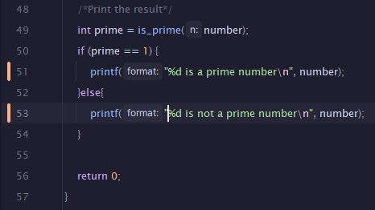

## EVALUACIÓN 1 ##

# Primeramente se creo la forma para poder evaluar si un número es negativo por medio de un if simple.

# Luego, se creó una fución de tipo long long en dónde se encuentra nuestro primer ciclo, este se encarga de hacer las mutliplicaciones necesarias para crear el factorial.

# Después de esto, se crea la función para evaluar si el número ingresado es primo. Es otro ciclo que va dividiendo el número por todos los anteriores hasta llegar al número proporcionado.

# Cuando se tienen estas funciones creadas, se pueden implementar en Main, guardar los resultados e imprimirlos

# 

# 

# 

# https://github.com/hacUPB/sc-control-version-iiKesler.git